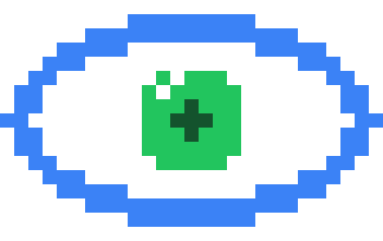

<p align="center">
  
</p>

# Watcher

Watches your application logs, notices crashes and errors on its own, and
explains the root cause with a small self-hosted model (via
[Ollama](https://ollama.com)). It runs in the background and reports — you never
invoke it against an incident by hand.

[](LICENSE)

## Install

Linux or macOS — no Go toolchain, compiler, or build step:

```sh
curl -fsSL https://github.com/shaheeranser/watcher/releases/latest/download/install.sh | sudo sh
```

The installer verifies the download against the published checksum and puts
`watcher` in `/usr/local/bin`. Set `WATCHER_INSTALL_DIR="$HOME/.local/bin"` for a
per-user install that needs no root. To remove it:

```sh
curl -fsSL https://github.com/shaheeranser/watcher/releases/latest/download/install.sh | sudo sh -s -- --uninstall
```

## Run

Watcher names no model of its own, so point it at a local Ollama and one log
source:

```sh
ollama serve
ollama pull qwen2.5:1.5b

watcher run --model qwen2.5:1.5b --file /var/log/app.log
```

`--model` is required. Results render for a terminal, or as one JSON object per
line when redirected:

```sh
watcher run --model qwen2.5:1.5b --file /var/log/app.log > incidents.jsonl
```

### Sources

```sh
tail -f app.log | watcher run --model qwen2.5:1.5b               # stdin
watcher run --model qwen2.5:1.5b --file /var/log/app.log         # one file
watcher run --model qwen2.5:1.5b \
  --source api=/var/log/api.log \
  --source worker=/var/log/worker.log                            # several, labelled
```

Inside Docker Compose, `watcher run` with no source attaches to the project's
sibling containers over the Docker socket; `--containers project=NAME` scopes it
explicitly and `--containers none` disables it.

A live terminal UI over the running daemon is available with `watcher attach`.

### Configure once (optional)

`watcher onboard` writes a config file and can install the systemd unit:

```sh
watcher onboard
systemctl enable --now watcher
```

It prompts for the Ollama URL — verifying it is reachable before writing
anything — a model, and one or more sources, then writes
`~/.config/watcher/config.toml`. Settings resolve as
`flag > environment > config file > default`, and every flag has a `WATCHER_*`
equivalent. Watcher never self-daemonizes: it runs in the foreground and leaves
backgrounding to your supervisor.

## Docker Compose

Runs Watcher alongside its own Ollama, pulling the model on first boot:

```sh
WATCHER_MODEL=qwen2.5:1.5b docker compose up --build
```

## Build from source

```sh
go build -o bin/watcher ./cmd/watcher
```

## Contributing

See [CONTRIBUTING.md](./CONTRIBUTING.md); AI coding agents should start at
[AGENTS.md](./AGENTS.md).

## License

MIT — see [LICENSE](./LICENSE).

Design rationale and per-milestone specs live in [`specs/`](./specs).
