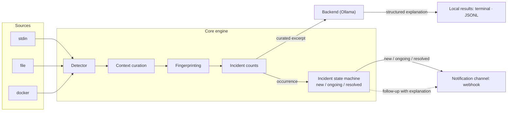

# Watcher

A background daemon that continuously watches application logs, notices crash
and error events on its own, and uses a small self-hosted model (via
[Ollama](https://ollama.com)) to explain the root cause.

[](LICENSE)

## Quickstart

Build from source (Go 1.26 or newer):

```sh
git clone https://github.com/shaheeranser/watcher
cd watcher
go build -o bin/watcher ./cmd/watcher
```

Watcher talks to a local Ollama instance, so pull a small model first:

```sh
ollama serve
ollama pull <model>
```

> Watcher never bundles or defaults a model — naming one is a deployment
> decision. Pass `--model` (or set `WATCHER_MODEL`); startup fails without it.

### Watch stdin

```sh
tail -f app.log | ./bin/watcher run
```

### Watch a single file

```sh
./bin/watcher run --file /var/log/app.log
```

`run` is the daemon entry point; the bare form (`watcher --file …`) is an alias
that keeps earlier invocations working. One instance can watch several labeled
sources at once, and the label is what a report attributes a crash to:

```sh
./bin/watcher run \
  --source backend=/var/log/backend.log \
  --source worker=/var/log/worker.log
```

Inside a Docker Compose deployment, `watcher run` with no source configured
attaches to its own project's sibling containers by default (over the Docker
socket); `--containers project=NAME`, `label=K=V`, `name=NAME`, or `service=NAME`
selects a scope explicitly, and `--containers none` disables it.

When stdout is a terminal the results are rendered for humans. When it is not,
Watcher emits one JSON object per line, so a pipe or a redirect gives you a
machine-readable incident stream:

```sh
./bin/watcher run --file /var/log/app.log > incidents.jsonl
```

## Configuration

Every setting can be given as a flag or an environment variable, with the flag
winning when both are present (flag > environment > default).

| Setting | Flag | Env | Default |
|---|---|---|---|
| Source file | `--file` | `WATCHER_FILE` | stdin |
| Labeled sources | `--source LABEL=PATH` | `WATCHER_SOURCES` | — |
| Docker scope | `--containers` | `WATCHER_CONTAINERS` | own Compose project |
| Docker socket | `--docker-host` | `WATCHER_DOCKER_HOST` | `unix:///var/run/docker.sock` |
| Docker lookback | `--docker-since` | `WATCHER_DOCKER_SINCE` | `0s` |
| Webhook URL | `--webhook-url` | `WATCHER_WEBHOOK_URL` | *(disabled)* |
| Webhook format | `--webhook-format` | `WATCHER_WEBHOOK_FORMAT` | `generic` |
| Webhook retries | `--webhook-retries` | `WATCHER_WEBHOOK_RETRIES` | `5` |
| Webhook backoff base / cap | `--webhook-backoff-base` / `-max` | `WATCHER_WEBHOOK_BACKOFF_BASE` / `_MAX` | `1s` / `30s` |
| Webhook fallback file | `--webhook-fallback` | `WATCHER_WEBHOOK_FALLBACK` | `undelivered.jsonl` |
| Notification throttle T | `--throttle-window` | `WATCHER_THROTTLE_WINDOW` | `15m` |
| Notification resolve window W | `--resolve-window` | `WATCHER_RESOLVE_WINDOW` | `2m` |
| Heartbeat URL | `--heartbeat-url` | `WATCHER_HEARTBEAT_URL` | *(disabled)* |
| Heartbeat interval | `--heartbeat-interval` | `WATCHER_HEARTBEAT_INTERVAL` | `60s` |
| Read API | `--api` | `WATCHER_API` | enabled |
| API socket path | `--api-socket` | `WATCHER_API_SOCKET` | `${XDG_RUNTIME_DIR}/watcher.sock` |
| Incident database | `--db` | `WATCHER_DB` | `watcher.db` |
| Retention (age) | `--retention` | `WATCHER_RETENTION` | `720h` |
| Occurrences per incident | `--occurrence-cap` | `WATCHER_OCCURRENCE_CAP` | `100` |
| UI refresh bound | `--refresh-interval` | `WATCHER_REFRESH_INTERVAL` | `2s` |
| List pane fraction | `--list-fraction` | `WATCHER_LIST_FRACTION` | `0.45` |
| Ollama base URL | `--ollama-url` | `WATCHER_OLLAMA_URL` | `http://localhost:11434` |
| Model | `--model` | `WATCHER_MODEL` | *(required)* |
| Preceding context lines (N) | `--context-before` | `WATCHER_CONTEXT_BEFORE` | `20` |
| Following context lines (M) | `--context-after` | `WATCHER_CONTEXT_AFTER` | `10` |
| Excerpt byte budget | `--context-budget` | `WATCHER_CONTEXT_BUDGET` | `8192` |
| Backend workers | `--workers` | `WATCHER_WORKERS` | `1` |
| Request timeout | `--ollama-timeout` | `WATCHER_OLLAMA_TIMEOUT` | `60s` |
| Generated-token cap | `--ollama-max-tokens` | `WATCHER_OLLAMA_MAX_TOKENS` | `512` |
| Explanation window | `--explain-window` | `WATCHER_EXPLAIN_WINDOW` | `15m` |
| Max block lines | `--max-block-lines` | `WATCHER_MAX_BLOCK_LINES` | `200` |
| Start file from beginning | `--from-start` | `WATCHER_FROM_START` | `false` |

```sh
WATCHER_MODEL=qwen2.5-coder:0.5b \
  ./bin/watcher --file /var/log/app.log --ollama-url http://ollama:11434
```

## Dashboard

The daemon is always headless: it never allocates or renders a terminal. It
writes incident history to SQLite, so a crash-looping service is still visible
after Watcher itself is restarted. A separate command renders that history:

```sh
./bin/watcher attach                     # connect to the running daemon
./bin/watcher attach --api-socket /run/user/1000/watcher.sock
```

`attach` reads the incident list, one incident's detail, and a live event stream
over the daemon's Unix socket (default `${XDG_RUNTIME_DIR}/watcher.sock`,
falling back to `/var/run/watcher.sock`); it never writes. The socket is created
`0600`, so access control is filesystem-based and no auth token is needed. When
no daemon answers, `attach` exits non-zero with an actionable message rather
than hanging or showing an empty screen; when the daemon restarts underneath it,
the UI shows a disconnected state and reconnects on its own.

Keys:

| Key | Action |
|---|---|
| `↑` / `k`, `↓` / `j` | Move selection |
| `g` / `G` | Jump to first / last row |
| `tab` / `shift+tab` | Switch focus between the list and detail panes |
| `pgup` / `pgdn` | Scroll the detail pane |
| `r` | Force refresh |
| `?` | Toggle the help overlay |
| `q`, `ctrl+c` | Quit attach (the daemon keeps running) |

The list is sorted unresolved-first, then by most-recent activity, so what is
currently failing is at the top; severity is shown per row but does not reorder,
so rows do not jump as severities arrive. `NO_COLOR` and `TERM=dumb` switch off
styling and use ASCII markers, and a terminal below 60×16 shows a single
"terminal too small" message instead of a broken layout.

### Read API

The daemon serves its history over a local, versioned read API, so other tooling
can consume it too, not just `attach`:

| Method | Path | Purpose |
|---|---|---|
| `GET` | `/api/v1/health` | Liveness, version, uptime, counters |
| `GET` | `/api/v1/incidents` | Incident list rows |
| `GET` | `/api/v1/incidents/{id}` | One incident's detail, explanation, and recent occurrences |
| `GET` | `/api/v1/events` | Server-Sent Events stream of mutations |

```sh
curl --unix-socket "${XDG_RUNTIME_DIR}/watcher.sock" http://watcher/api/v1/incidents
```

`{id}` is `source:fingerprint`, stable across restarts. Disable the API with
`--api=false`; the daemon keeps detecting and notifying. If the database cannot
be opened, the daemon logs the failure, keeps detecting and notifying, and
serves current in-memory state with a "history unavailable" marker in the UI.

## Docker Compose

The repository ships a Compose stack that runs Watcher alongside its own Ollama:

```sh
WATCHER_MODEL=qwen2.5:1.5b docker compose up --build
```

- `ollama` — the model server. Its weights live in the `ollama-models` named
  volume, so they are pulled once and reused on later boots.
- `ollama-init` — a one-shot service that runs `ollama pull "$WATCHER_MODEL"`
  on first boot. `watcher` waits for it, so a clean machine needs no manual
  pull.
- `watcher` — the daemon, built from the repository `Dockerfile`, waiting until
  Ollama reports healthy. The Docker socket is mounted **read-only**; with no
  `--containers`, `watcher run` attaches to this project's sibling containers.

`WATCHER_MODEL` is required — put it in a `.env` file next to `compose.yaml` to
keep the command short. The stack also reads `WATCHER_WEBHOOK_URL`,
`WATCHER_WEBHOOK_FORMAT` (default `discord`), `WATCHER_HEARTBEAT_URL`,
`WATCHER_HEARTBEAT_INTERVAL`, `WATCHER_THROTTLE_WINDOW`, and
`WATCHER_RESOLVE_WINDOW`; everything except the model has a working default.
The service restarts unless stopped and keeps detecting and counting even while
the model is temporarily unavailable, so a model outage delays explanations but
never the alert.

## Architecture

Log lines flow through four interfaces, with the crash-dedup and context work
sitting in the middle so that the expensive model call happens rarely and with
clean input:



- **Source** — produces log lines, each tagged with an operator-assigned label:
  one or more files, stdin, or the sibling containers of Watcher's own Compose
  project (streamed over the Docker socket).
- **Detector** — matches crash/error patterns (Go panics, Python tracebacks,
  generic `FATAL`/`Exception` lines) and assembles the multi-line block.
- **Backend** — sends a bounded, curated excerpt to Ollama and returns
  structured fields: summary, likely cause, evidence, suggested fix,
  confidence, severity.
- **Sink** — delivers the finished result. The local stream (terminal or JSON
  lines) reports every occurrence with a rising count. The notification channel
  (webhook) is gated by the incident state machine, so it carries only `new`,
  `ongoing`, and `resolved` — a crash loop produces one alert, periodic
  "still happening" updates, and one resolution, not one message per occurrence.

Two properties this design protects: it is a **push** system (it notices and
reports on its own, and never waits for you to invoke it against an incident),
and it **deduplicates** (a crash-looping process produces one incident with a
live count, not one alert per occurrence).

The first notification goes out *before* the model call, carrying an explicit
`explanation_pending` marker; a follow-up notification delivers the explanation
once it is ready. That keeps alert latency independent of model latency, so a
slow or unreachable Ollama delays the diagnosis without delaying the alert. A
**heartbeat** — a periodic ping carrying liveness counters — can be pointed at a
dead-man's-switch URL, so Watcher's own silence is itself detectable.

## Roadmap

- [x] `00` — Scaffolding (repository hygiene)
- [x] `01` — Core engine (stdin/file source, detector, fingerprinting, context
      curation, Ollama backend, guardrail, output)
- [x] `01b` — Runtime (run verb, labeled multi-source incl. Docker container
      logs, webhook sink)
- [x] `02` — Production shape (Compose packaging, incident state machine,
      heartbeat)
- [x] `03` — Dashboard (headless daemon, read API, `watcher attach` TUI, SQLite
      history)
- [ ] `04` — Evaluation (ground-truth scoring, pass/fail tally)
- [ ] `05` — Install lifecycle (installer, `watcher onboard`, config file,
      systemd unit)

Detailed design documentation for each milestone lives in
[`specs/`](./specs), which is committed and public: `requirements.md` (testable
acceptance criteria), `design.md` (rationale and interfaces), and `tasks.md`.
Uncommitted planning notes live in `docs/`, which is not tracked.

## Evaluation harness

Explanations are scored against known failures produced by
[`shaheeranser/watcher_victim`](https://github.com/shaheeranser/watcher_victim),
a separate failure-injection harness. It runs a deliberately fragile Node
service under Docker and can trigger three failures on demand, each with a
documented ground-truth root cause in `scenarios/*.json`:

| Scenario | Failure |
|---|---|
| `bad-input` | A null field makes `POST /api/items` dereference null — an uncaught `TypeError` with a real stack trace. |
| `restart-loop` | Startup config validation throws before `listen()`; Docker restart-loops the byte-identical crash. |
| `timeout` | `POST /api/bulk` buffers a body with no size limit and exhausts the V8 heap. |

The harness scores Watcher by pointing its `evaluate.py` at Watcher's output —
a captured JSON Lines file or a URL — so the two repos share no code:

```sh
./bin/watcher run --file victim.log --model <model> > results.jsonl
./evaluate.py --watcher results.jsonl --runs 5 --report reports/latest.md
```

`evaluate.py` accepts a JSON array, JSON Lines, or a single object (a webhook
payload works too) and finds `likely_cause` in each record. In-repo scoring
(`watcher eval`) is specified in
[`specs/04-evaluation/design.md`](./specs/04-evaluation/design.md) §7 but is not
implemented yet; until it is, the harness scores with its own script. See
`docs/victim/` for per-run notes on the harness.

### Live procedure

The harness recreates its `victim-api` container on every scenario, so a piped
`docker compose logs -f | watcher` stream dies with the container. Running
Watcher against the harness's **Compose project** — and letting it follow
container logs over the Docker socket — survives that recreation, because it
reattaches as containers start and stop.

```sh
# 1. Bring the harness up and reset it.
cd watcher_victim && ./break.sh reset

# 2. In one terminal, run Watcher against the harness's Compose project (the
#    project name defaults to the directory name) and capture its JSON Lines.
/path/to/bin/watcher run --containers project=watcher_victim \
  --model <model> --ollama-url http://localhost:11434 \
  > /tmp/watcher-victim.jsonl

# 3. In another terminal, trigger each scenario and score the result.
./evaluate.py --watcher /tmp/watcher-victim.jsonl --runs 3 --report reports/latest.md
```

If Watcher itself runs as a container in that Compose project, plain
`watcher run` with no `--containers` attaches to the project's siblings by
default, so no selector is needed. Expected result: a per-scenario PASS/FAIL
table and a pass rate, with each incident line carrying a `likely_cause` the
scorer reads. The same output can be pushed to Slack/Discord by adding
`--webhook-url` and `--webhook-format`.

## Contributing

See [CONTRIBUTING.md](./CONTRIBUTING.md). AI coding agents should start at
[AGENTS.md](./AGENTS.md).

## License

MIT — see [LICENSE](./LICENSE).
