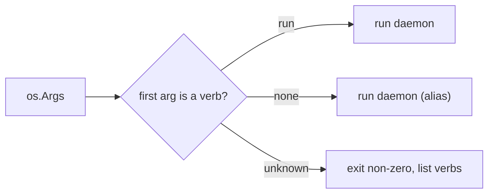
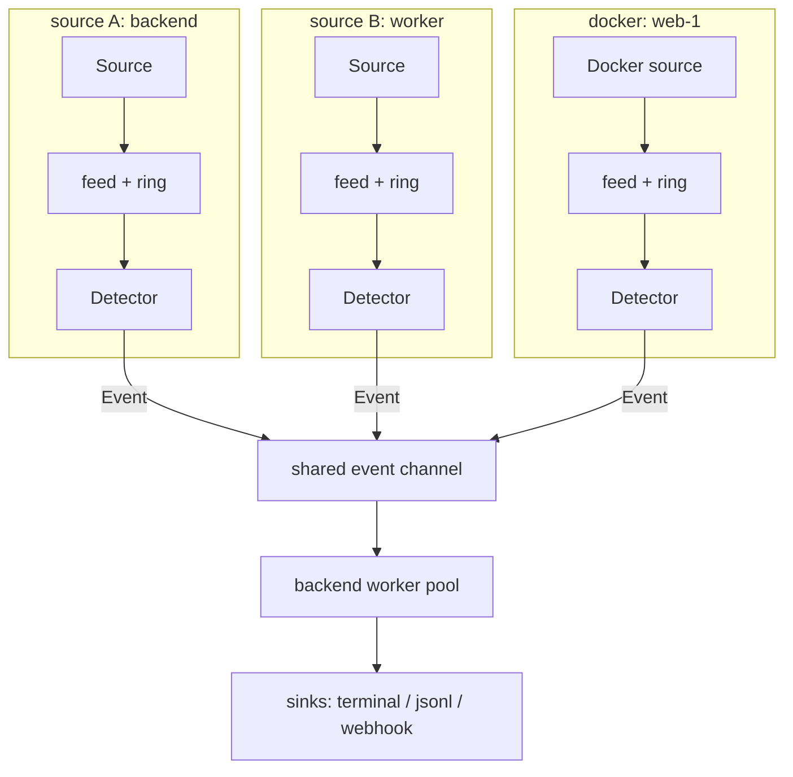
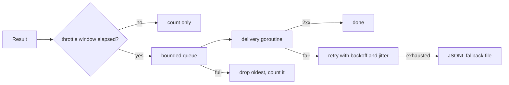

# 01b — Runtime: Design

Requirements: [`requirements.md`](./requirements.md). Tasks:
[`tasks.md`](./tasks.md).

Dependencies: builds directly on milestone 01 (the `Source`/`Detector`/
`Backend`/`Sink` interfaces, the pipeline wiring, config precedence). It is a
dependency of milestone 02 (which packages and adds the notification lifecycle)
and of 05 (install/onboarding). It depends on nothing later than itself.

## 1. Goals and constraints

Milestone 01 proved the pipeline; this milestone makes it a *runnable daemon*.
Three constraints shape the design:

- **One instance, many sources.** A real deployment watches several things —
  a couple of log files on a device, or every service in a Compose project.
  Watching must not mean running one process per source.
- **Attribution is explicit, never inferred.** A report has to say *which*
  source a crash came from. The only trustworthy source of that fact is an
  operator-assigned label; a merged, unlabeled stream with content-based
  guessing is rejected outright (§10).
- **The same binary in every shape.** Container and device differ in config
  source, supervisor, and where logs come from — not in the pipeline. This
  milestone is where that symmetry becomes real, because it adds the Docker
  source and the delivery sink that both shapes share.

## 2. CLI grammar

The binary becomes verb-dispatched. `run` is the daemon; the bare form stays as
an alias so nothing built in 01 breaks.

```
watcher run [flags]        # the daemon (this milestone)
watcher     [flags]        # alias for `watcher run`
watcher --help             # verbs, then run's flags
```



Design notes:

- Dispatch is a small registry (`map[string]func(argv) int`); 01b registers only
  `run`. `onboard` (05), `eval` (04), and `attach` (03) register here later, so
  the grammar is fixed once rather than re-litigated per milestone.
- The alias exists precisely so `watcher --file /var/log/app.log` keeps working;
  RT-CLI-2 makes that a requirement, not a courtesy.
- Exit codes are unchanged from 01 (CORE-OUT-5): 2 for bad configuration, 1 for
  a fatal startup error (guard trip, unreachable Docker socket), 0 otherwise.

## 3. Multi-source architecture

### 3.1 Labels

A source's label is the identity that flows to the report. It is set by the
operator (or defaulted: a lone file uses its path, stdin uses `stdin`, a
container uses its Compose service name), and every `Line` it produces carries
it in `Line.Source`. This is a renaming of intent rather than a new field: in 01
`Line.Source` already held "stdin" or the file path; it is now explicitly the
*label*, and the operator may override it.

### 3.2 Incident identity is `(label, fingerprint)`

**The fingerprint hash itself does not change.** It stays
`sha256(kind + "\n" + normalized)` (01 §6). What changes is the *key the
incident tracker uses*: `(label, fingerprint)` instead of `fingerprint` alone.
The consequences that matter:

- The same crash text on two labels is two incidents, each explained once and
  each reported with its own label (RT-SRC-5). This is the correct reading of
  "the same crash on the backend and the frontend are different incidents".
- Because the hash is untouched, milestone 01's fingerprints, property tests,
  and golden fixtures remain valid. Putting the label *into* the hash was
  considered and rejected: it would silently change every fingerprint already
  produced and break CORE-FP's example/property tests for no benefit.
- "Threaded through fingerprinting" is therefore read as *the label passes
  through the fingerprinting stage alongside the hash*, not *the label is hashed
  into it*. See the open decision OD-01B-1.

### 3.3 Fan-in

Each source gets its own `Source` → feeder → ring → `Detector` triple, because
both the context ring and the detector's block-assembly state are *per stream*:
a panic in one file must never be assembled with lines from another. The
per-source stages emit into one shared event channel consumed by the backend
worker pool and the sinks.



- One source ending closes only its own stages (RT-SRC-6). The daemon exits 0
  when the last source ends; cancellation stops it immediately.
- Each source's feeder applies backpressure to *its* source only (RT-SRC-8);
  the shared event channel is bounded, so a starved consumer still bounds
  memory rather than growing without limit.

### 3.4 Default labels

RT-SRC-9 defaults are chosen so the single-source invocations from 01 read the
same as before: a lone `--file /var/log/app.log` reports label
`/var/log/app.log`, and stdin reports `stdin`.

## 4. Docker container source

### 4.1 API surface

Over the socket (`unix:///var/run/docker.sock`): `GET /containers/json` to list,
`GET /containers/{id}/logs?follow=1&stdout=1&stderr=1&since=…` to stream,
`GET /events` to learn about lifecycle, and `GET /containers/{id}/json` to learn
whether the container is a TTY. Authorization is the socket's filesystem
permissions.

### 4.2 Default scope: Watcher's own Compose project

RT-DOCK-2 makes the zero-argument case meaningful *inside a container*: attach
to the siblings of Watcher's own Compose project, never the whole host.

To do that Watcher must know which project it is in:

1. Resolve its own container id (from `/proc/self/cgroup`, falling back to the
   hostname).
2. Inspect that container (`GET /containers/{id}/json`) and read the
   `com.docker.compose.project` label.
3. List containers carrying the same project label, excluding itself.

If Watcher is *not* in a container, or its container carries no Compose project
label, the zero-argument default is **not** Docker — it stays milestone 01's
stdin behaviour. This is deliberate: a bare `watcher run` on a developer's
machine must not silently attach to every container they happen to be running.
An explicit selector (`--containers`) always wins.

> **Flagged:** this changes the meaning of the zero-argument invocation *in a
> container*, from "read stdin" to "attach to project siblings". It is the
> documented default the container deployment wants, but it is a behavioural
> change against built 01 and is called out here rather than reconciled
> silently. See OD-01B-2.

### 4.3 Framing and lifecycle

Non-TTY streams are multiplexed: an 8-byte header (`stream u8`, three pad
bytes, big-endian u32 length) then the payload; `stream` 1 is stdout, 2 is
stderr. The reader reassembles partial lines per stream (RT-DOCK-4). A
supervisor goroutine owns a `containerID → cancel` map, attaching on
`start`/`restart` and cancelling on `die`/`stop` (RT-DOCK-5), with backoff on
transient errors (RT-DOCK-9). Container identity becomes the label (RT-DOCK-6).

### 4.4 Self-exclusion and failure

The milestone-01 guard (`internal/guard`) already refuses a source that is
Watcher's own stdout/stderr. It is extended with the container hook 01 stubbed
out: resolve Watcher's own container id (as in §4.2) and refuse to attach to it
(RT-DOCK-7). A missing or unauthorized socket fails fast at startup with a clear
diagnostic (RT-DOCK-8) — but only when a Docker source is actually requested;
a device run without Docker must not fail.

## 5. Webhook sink

### 5.1 Providers

The three providers share the notification *content* and differ only in
envelope and limits. They do **not** share a body, as the naive assumption
suggests.

- **Slack** — `{"text": …, "blocks": [...]}` (Block Kit, `mrkdwn`).
- **Discord** — `{"content": …, "embeds": [...]}`; `content` ≤ 2000 chars, ≤ 10
  embeds and ≤ 6000 characters across them; per-webhook rate limits answered
  with `429` + `Retry-After`.
- **Generic** — a flat JSON object carrying the RT-WH-3 field set, for any
  receiver.

RT-WH-4 caps log-derived text per provider (and marks truncation), so a long
excerpt cannot produce an undeliverable body.

### 5.2 Delivery



- **Retry**: `delay = min(cap, base · 2^(n-1))` with jitter in `[0.5, 1.0]`,
  honouring `Retry-After` (RT-WH-5).
- **Fallback**: on exhaustion, one JSON line per notification to a spool file,
  including the last error (RT-WH-6); draining the spool is not automated here.
- **Queue**: bounded, drop-oldest with a logged dropped counter, so a wedged
  webhook never stalls detection (RT-WH-7).
- **Fan-out**: a small multiplexer delivers to each configured sink
  independently (RT-WH-9).

### 5.3 The minimal throttle

The state machine that makes "notify once per new incident, then only on
escalation" possible arrives in 02. Until then, a crash loop would otherwise
post on every occurrence. RT-WH-8 emits **at most one notification per
`(label, fingerprint)` per window**, while the local stream and the incident
count still update on every occurrence.

This is deliberately distinct from milestone 01's `--explain-window`, which
gates *model calls*; the throttle gates *outbound notifications*. Two windows,
two purposes. When 02 lands, its `new`/`ongoing`/`resolved` transitions replace
this throttle (and the throttle flag is retired or aliased).

## 6. Concurrency and shutdown

The 01 pipeline (one goroutine per stage, buffered channels, `WaitGroup`
shutdown) is extended from one source to N: each source owns its feeder,
ring, and detector; a shared event channel feeds the worker pool; sinks are
shared and thread-safe. `Run` waits for all sources, then the workers, then
closes the sink queue (RT-NFR-1). The sink queue's non-blocking drop policy is
unchanged from 01.

## 7. Configuration

New settings, all following `flag > env > default` (a config-file rung is 05's
job):

| Setting | Flag | Env | Default |
|---|---|---|---|
| Source (repeatable) | `--source LABEL=PATH` | `WATCHER_SOURCES` | — |
| Single file (shorthand) | `--file PATH` | `WATCHER_FILE` | stdin |
| Docker selector | `--containers` | `WATCHER_CONTAINERS` | Compose project, only when in one |
| Docker socket | `--docker-host` | `WATCHER_DOCKER_HOST` | `unix:///var/run/docker.sock` |
| Docker lookback | `--docker-since` | `WATCHER_DOCKER_SINCE` | `0s` |
| Webhook URL | `--webhook-url` | `WATCHER_WEBHOOK_URL` | none |
| Webhook provider | `--webhook-format` | `WATCHER_WEBHOOK_FORMAT` | `generic` |
| Webhook retries | `--webhook-retries` | `WATCHER_WEBHOOK_RETRIES` | `5` |
| Webhook backoff base / cap | `--webhook-backoff-base` / `-max` | `WATCHER_WEBHOOK_BACKOFF_BASE` / `_MAX` | `1s` / `30s` |
| Webhook fallback file | `--webhook-fallback` | `WATCHER_WEBHOOK_FALLBACK` | `undelivered.jsonl` |
| Notification throttle | `--throttle-window` | `WATCHER_THROTTLE_WINDOW` | `15m` |

The Docker selector grammar, resolved with OD-01B-3 below: an empty value (or
`compose`) is the default scope; `project=NAME`, `label=KEY=VALUE`, `name=NAME`,
and `service=NAME` are explicit selectors that override it; `none` disables the
Docker source. In a source spec, a path of `-` names stdin, so a file source and
stdin can be mixed under distinct labels.

## 8. Failure modes

| Failure | Behaviour |
|---|---|
| One source reaches EOF | That source stops; the daemon continues with the others |
| Docker socket missing/unauthorized (source requested) | Fatal at startup, clear diagnostic, non-zero exit |
| Container stream drops | Reconnect with backoff; other containers keep streaming |
| Watch target container is Watcher's own | Refused by the guard |
| Webhook 5xx repeatedly | Retries with backoff, then the fallback file |
| Webhook queue saturated | Drop-oldest with a logged counter; detection unaffected |
| Ollama unreachable | Incident still notified with an explicit unavailable marker |
| Zero-arg `run`, not in a Compose project | Falls back to stdin, never "all containers" |

## 9. Testing strategy

- **CLI** — table tests for verb dispatch: `run`, alias, unknown verb, help,
  exit codes.
- **Multi-source** — N sources in one engine; per-source rings and detectors do
  not cross-contaminate; one EOF does not stop the others; duplicate labels
  rejected; the same crash on two labels yields two incidents.
- **Docker framing** — synthetic multiplexed byte streams, frames split
  mid-line, stdout/stderr interleave; TTY raw stream.
- **Docker lifecycle** — a fake Docker API over a unix socket listener emitting
  `start`/`die`; assert attach/detach and reattach on restart.
- **Docker default scope** — assert project-label filtering selects siblings and
  excludes self, and that a non-Compose environment does not default to Docker.
- **Webhook** — `httptest` receiver asserting each provider's payload shape;
  retry/backoff timing and `Retry-After` with a fake clock; fallback file
  contents; full-queue drop; throttle suppresses repeats within the window.
- **End to end** — a fixture log plus a fake backend: sources → incidents →
  JSONL, and the harness-consuming shape.

## 10. Rejected approaches

**Inferring a source from log content.** It is tempting, when watching one merged
stream, to inspect each line and guess which service it belongs to — e.g. by
matching a port number or a hostname mentioned in the text. This is **rejected**,
and is recorded here rather than left unmentioned:

- It is unreliable: log text is unstructured, and the same token (`:8080`,
  `backend`) appears in unrelated lines.
- It is unverifiable: there is no ground truth to score the guess against,
  which is exactly the property the rest of the product depends on.
- It silently produces *wrong* attribution, which is worse than none.

A multi-source deployment registers each thing to watch as its own labeled
source (RT-SRC-7). If an operator wants three services, they configure three
sources; the boundary is always drawn explicitly, never inferred.

## 11. Compatibility with milestone 01

Called out so the change is deliberate, not accidental:

1. **Source constructors gain a label.** `NewStdin`/`NewFile` take a label;
   defaults preserve the current `Name()` values, so behaviour is unchanged for
   existing invocations.
2. **The engine takes a slice of sources** instead of one. `Engine.Run`'s
   contract (clean shutdown, exit 0) is preserved.
3. **`Line.Source` is now "the label".** For 01's use cases the value is the
   same string, so downstream code is unaffected.
4. **The zero-arg default changes only inside a Compose container** (§4.2);
   everywhere else it remains stdin.
5. **The fingerprint hash is unchanged**, so 01's tests and fixtures stay valid.

## 12. Decisions

These were open when the milestone was drafted. They are now resolved; the
values below are what the implementation uses, with the reasoning recorded so a
later milestone can revisit a choice rather than rediscover it.

- **OD-01B-1 — Label in the fingerprint hash.** *Resolved:* no. The hash stays
  `sha256(kind + "\n" + normalized)` and incidents are keyed on
  `(label, fingerprint)`. Folding the label into the hash would change every
  fingerprint milestone 01 produced and break its tests and fixtures for no
  benefit.
- **OD-01B-2 — Precedence when a source and the Docker default both apply.**
  *Resolved:* an explicit source wins outright; the own-Compose-project default
  applies only when no source is configured. An explicit `--containers` is not
  a "default" and still applies alongside configured sources.
- **OD-01B-3 — Default Docker lookback.** *Resolved:* `0s` — start from now.
  This mirrors milestone 01's file source (which starts at the current end), so
  a restart reports only new crashes rather than replaying history.
- **OD-01B-4 — Webhook retry count, backoff base, and cap.** *Resolved:* 5
  attempts, 1s base, 30s cap (`delay = min(cap, base·2^(n-1))`, jitter in
  `[0.5, 1.0]`, `Retry-After` honoured). Tolerant of a brief receiver outage
  without holding a notification for minutes.
- **OD-01B-5 — Fallback spool path.** *Resolved:* `undelivered.jsonl` in the
  working directory, matching the existing `.gitignore` entry. Replaying the
  spool is not automated here.
- **OD-01B-6 — Default notification throttle window.** *Resolved:* 15m, the same
  as `--explain-window`, so a crash loop yields one model call and one
  notification per 15 minutes until 02's state machine replaces the throttle.
- **OD-01B-7 — Discord default rendering.** *Resolved:* an embed (title +
  description), with a one-line `content` summary. The embed carries the detail
  and each field is capped to Discord's limits.
- **OD-01B-8 — Docker client dependency.** *Resolved:* a minimal hand-rolled
  client over the socket using `net/http`, no SDK. The project's dependency rule
  (`specs/style-guide.md` §9) puts the standard library first, the four
  read-only endpoints we use are among the API's most stable, and we own the
  frame demultiplexer either way — so the SDK's size and transitive tree buy
  little here, while the hand-rolled client keeps the binary a single static
  `CGO_ENABLED=0` build and the tests a plain unix-socket listener.

One deviation worth recording: an *auto* Docker default (no `--containers`) that
cannot reach the socket logs a warning and falls back to stdin, whereas an
*explicit* `--containers` fails fast (RT-DOCK-8). This keeps a bare-metal run
from requiring a socket it never asked for, while still failing loudly when the
operator asked for Docker.
