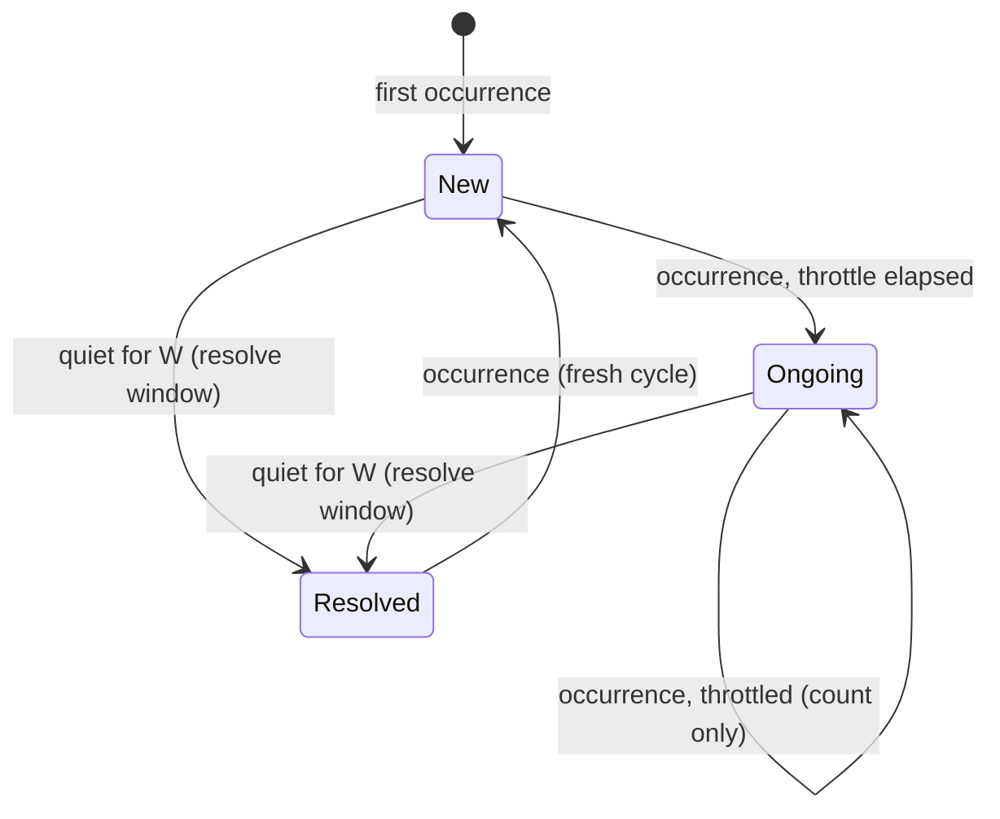

# 02 — Production Shape: Design

Requirements: [`requirements.md`](./requirements.md). Tasks:
[`tasks.md`](./tasks.md).

Dependencies: builds on `../01b-runtime/design.md` — the `run` verb and verb
grammar, the labeled multi-source engine, the Docker container-log source, and
the webhook sink — which in turn build on
`../01-core-engine/design.md` (the four interfaces, the `Result` type, the
pipeline wiring, config precedence). This milestone adds packaging, the
notification state machine, and the heartbeat; it changes no core interface.

## 1. What changes relative to 01b

| Area | 01b | This milestone |
|------|-----|----------------|
| Sources | stdin/file/docker, labeled | unchanged |
| Sink | terminal, JSONL, webhook + minimal throttle | + notification kinds, state-machine gating |
| Incident tracking | counts + explanation window + throttle | + `new`/`ongoing`/`resolved` state machine |
| Packaging | single binary | + Compose stack with Ollama |
| Visibility | stderr diagnostics | + heartbeat |

The pipeline is unchanged. The tracker gains notification *policy*, and the
webhook sink's minimal throttle (01b §5.3) is superseded by the state machine
(PROD-STM-9).

## 2. Compose packaging

```yaml
services:
  ollama:
    image: ollama/ollama:latest
    volumes: ["ollama-models:/root/.ollama"]
    healthcheck:
      test: ["CMD", "ollama", "list"]
      interval: 5s
      timeout: 5s
      retries: 24
    restart: unless-stopped

  ollama-init:
    image: ollama/ollama:latest
    depends_on:
      ollama: { condition: service_healthy }
    environment:
      OLLAMA_HOST: "http://ollama:11434"
      MODEL: "${WATCHER_MODEL}"
    entrypoint: ["/bin/sh", "-c", "ollama pull \"$$MODEL\""]
    restart: "no"

  watcher:
    build: .
    depends_on:
      ollama: { condition: service_healthy }
      ollama-init: { condition: service_completed_successfully }
    volumes:
      - "/var/run/docker.sock:/var/run/docker.sock:ro"
    environment:
      WATCHER_OLLAMA_URL: "http://ollama:11434"
      WATCHER_MODEL: "${WATCHER_MODEL}"
      WATCHER_WEBHOOK_URL: "${WATCHER_WEBHOOK_URL:-}"
      WATCHER_WEBHOOK_FORMAT: "${WATCHER_WEBHOOK_FORMAT:-discord}"
      WATCHER_HEARTBEAT_URL: "${WATCHER_HEARTBEAT_URL:-}"
    restart: unless-stopped

volumes:
  ollama-models:
```

Design notes:

- The `watcher` image's entrypoint is `watcher run` (01b's verb). Compose
  supplies the whole configuration through environment variables, so no
  onboarding or config file is involved in the container shape.
- Watcher attaches to **its own Compose project's** siblings by default
  (01b RT-DOCK-2), which is why the socket is mounted and no `--containers`
  selector is required for the common case.
- Model auto-pull (PROD-PKG-3) is a one-shot `ollama-init` service rather than
  logic inside `watcher`, keeping the daemon's startup simple and letting the
  pull be retried independently.
- The named volume (PROD-PKG-4) means the pull happens once, not per boot.
- `watcher` depends on `ollama` health, not on `ollama-init` only, so a
  pre-pulled model still converges (PROD-PKG-2).
- The socket is mounted read-only (PROD-PKG-5): Watcher only reads logs and
  events.

## 3. Incident state machine

### 3.1 States and transitions



- `New` — first occurrence. Emit a `new` notification immediately
  (PROD-STM-1). Record `lastNotifiedAt = now`, `notificationKind = new`.
- `Ongoing` — subsequent occurrences are counted into the incident and
  **suppressed**, except that at most one `ongoing` notification per throttle
  window `T` is emitted, reporting the current cumulative count
  (PROD-STM-2, PROD-STM-5). This is the anti-spam rule: a crash loop produces
  one incident with a rising count.
- `Resolved` — a single ticker evaluates all active incidents; when
  `now - lastSeen >= W` it emits one `resolved` notification with the final
  count and marks the incident resolved (PROD-STM-3).
- After `Resolved`, a further occurrence restarts the cycle at `New`
  (PROD-STM-4), so a genuinely recurring problem is not permanently silenced.

The throttle window `T` is the same setting 01b introduced for its minimal
throttle (`--throttle-window`); this milestone gives it its real meaning. Once
the state machine is active, the standalone throttle no longer gates delivery
(PROD-STM-9).

### 3.2 Why a separate component

The state machine is `internal/incident`'s notification decision layer,
sitting between the tracker's counting and the sinks. This keeps the tracker
(which answers "how many times, when") independent from delivery policy (which
answers "should we tell anyone right now"). It also means the milestone-03
TUI, which only needs counts and history, does not have to reason about
throttling.

### 3.3 Restart semantics

State is process-local in this milestone, so on restart the memory of
fingerprints is lost. The rule that falls out (PROD-STM-7): the resolve ticker
only resolves incidents it is currently tracking, so a restart never produces
a spurious `resolved` burst for incidents that existed only in the previous
process. Those fingerprints are simply encountered fresh and produce a `new`
notification, which is the honest behavior for a stateless restart.

### 3.4 Pending explanations

If the fingerprint is new, the explanation is still in flight when the `new`
notification fires (the model call is asynchronous by design, milestone 01
§11). Rather than hold the notification, emit it immediately with
`explanation_pending: true` (PROD-STM-8) and include the explanation fields as
null/placeholder. This protects the push-not-pull property: notification
latency is never a function of model latency.

## 4. Heartbeat

`internal/heartbeat` runs its own ticker (PROD-HB-3), independent of incident
traffic, so that Watcher's *silence* is itself detectable by a dead-man's-
switch receiver: if the process dies or loses network, the receiver notices
the missing pings.

- Disabled unless `WATCHER_HEARTBEAT_URL` is set (PROD-HB-5).
- Each ping is an HTTP `POST` with a small JSON body carrying the timestamp and
  liveness counters (PROD-HB-2).
- A failed ping is logged and dropped; there is no unbounded retry
  (PROD-HB-4) — the *absence* of the next ping is the signal.

Payload:

```json
{
  "timestamp": "2026-01-02T15:06:11Z",
  "uptime_seconds": 3600,
  "lines_processed": 128400,
  "incidents_tracked": 7,
  "notifications_sent": 19,
  "notifications_dropped": 0
}
```

## 5. Configuration added in this milestone

| Setting | Flag | Env | Default |
|---------|------|-----|---------|
| Throttle window T (given its real meaning) | `--throttle-window` | `WATCHER_THROTTLE_WINDOW` | *OD-02-1* |
| Resolve window W | `--resolve-window` | `WATCHER_RESOLVE_WINDOW` | *OD-02-2* |
| Heartbeat URL | `--heartbeat-url` | `WATCHER_HEARTBEAT_URL` | none |
| Heartbeat interval | `--heartbeat-interval` | `WATCHER_HEARTBEAT_INTERVAL` | *OD-02-3* |

`--throttle-window` was introduced in 01b (`RT-CFG-1`); this milestone is
where it stops being a stop-gap and becomes the state machine's `T`.

## 6. Failure modes

| Failure | Behavior |
|---------|----------|
| Ollama down | Incident still notified with `explanation_pending` |
| Heartbeat endpoint down | Log, skip, continue; next ping is the signal |
| Clock skew across containers | Timestamps come from Watcher's own clock, never from container logs |
| Notification queue saturated | 01b's drop-oldest policy applies; detection unaffected |

Docker-source and webhook-delivery failure modes are 01b's (see
`../01b-runtime/design.md` §8) and are unchanged here.

## 7. Testing strategy

- **State machine** — table-driven tests with an injectable clock covering:
  first occurrence, suppressed repeats, throttled `ongoing`, `resolved`,
  recurrence after resolve, and restart-without-spurious-resolve.
- **Heartbeat** — fake clock + `httptest`; assert cadence independence from
  incident traffic.
- **Packaging** — brought up locally: the stack reaches healthy with the model
  auto-pulled, and detection continues with Ollama stopped.
- **Integration** — Compose locally: a crash-looping test container plus a
  receiver; assert one `new`, throttled `ongoing`, and a final `resolved`.

## 8. Open decisions

- **OD-02-1** — Default throttle window `T` (how often "still happening" pings
  a crash loop). Too short defeats dedup; too long hides escalation.
- **OD-02-2** — Default resolve window `W` (quiet period before "resolved").
  Must be larger than typical restart jitter.
- **OD-02-3** — Default heartbeat interval, and whether the default heartbeat
  payload shape should match a specific dead-man's-switch provider or stay
  generic.
- **OD-02-4** — Whether a `resolved` notification should be suppressed when the
  incident never had a successful explanation.
- **OD-02-5** — Whether counts reset when an incident reopens after `resolved`,
  or continue cumulatively across cycles.

Moved to `../01b-runtime/design.md` §12 with their mechanisms: the Docker client
dependency choice (was OD-02-6), the Docker lookback default (was OD-02-8), the
container selector syntax (was OD-02-10), and the webhook retry/backoff,
fallback path, and resolved-without-explanation questions (were OD-02-4,
OD-02-5, OD-02-11).
