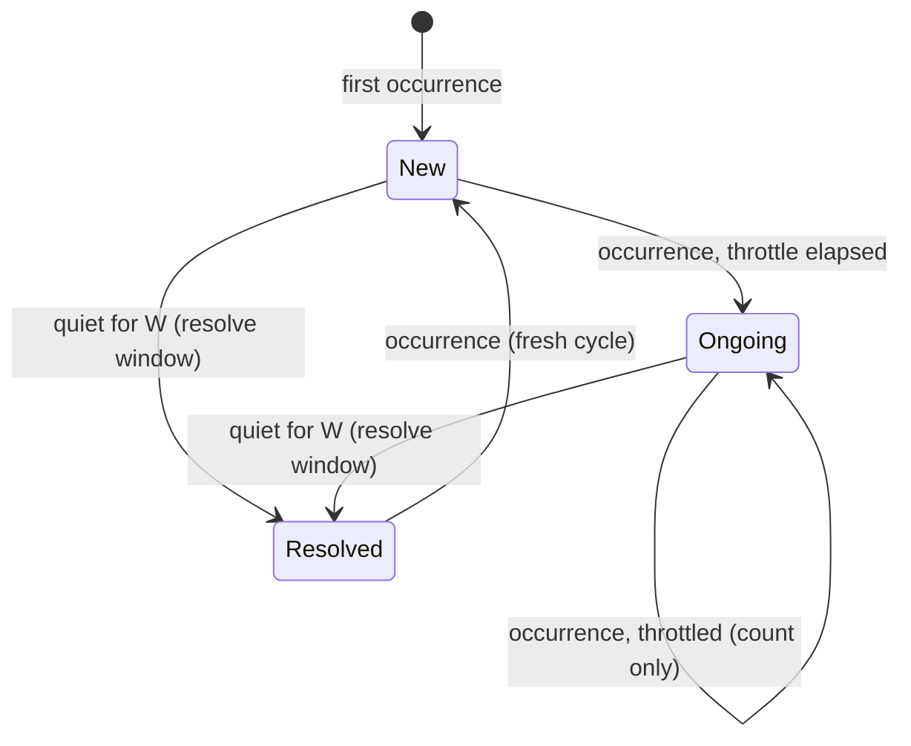

# 02 — Production Shape: Design

Requirements: [`requirements.md`](./requirements.md). Tasks:
[`tasks.md`](./tasks.md).

Dependencies: builds on `../01-core-engine/design.md` — the `Source`,
`Detector`, `Backend`, `Sink` interfaces, the `Result` type, the pipeline
wiring, and the config precedence model. This milestone adds implementations
and one new intervening component (the incident state machine); it does not
change the core interfaces' shape.

## 1. What changes relative to milestone 01

| Area | Milestone 01 | This milestone |
|------|--------------|----------------|
| Sources | stdin, single file | + Docker container streams (multi-source) |
| Sink | terminal, JSONL | + webhook, + notification kinds |
| Incident tracking | counts + explanation window | + `new`/`ongoing`/`resolved` state machine |
| Packaging | single binary | + Compose stack with Ollama |
| Visibility | stderr diagnostics | + heartbeat |

The pipeline in `../01-core-engine/design.md` §2 is unchanged; the tracker
gains notification decisions and the sink fan-out gains kinds.

## 2. Docker source

### 2.1 API surface used

Over the Unix socket (`unix:///var/run/docker.sock`), Watcher uses:

- `GET /containers/json?filters=…` — initial set of containers matching the
  selector.
- `GET /containers/{id}/logs?follow=1&stdout=1&stderr=1&since=<lookback>` —
  the log stream per container.
- `GET /events?filters={"type":["container"],"event":["start","die","stop","restart"]}`
  — a single long-lived stream used to attach/detach sources as containers come
  and go (PROD-SRC-4, PROD-SRC-5).
- `GET /containers/{id}/json` — to learn whether the container is TTY, which
  determines the stream framing (PROD-SRC-2).

Authorization is the socket's filesystem permissions; no API version
negotiation beyond the `Docker-Daemon-Version` header is required.

### 2.2 Stream framing

Non-TTY container streams are multiplexed. Each frame is:

```
+--------+--------+--------+--------+--------+--------+--------+--------+
| stream |  0x00  |  0x00  |  0x00  |        payload length (BE u32)     |
+--------+--------+--------+--------+--------+--------+--------+--------+
|                          payload bytes …                              |
```

`stream == 1` is stdout, `stream == 2` is stderr. The reader:

1. Reads the 8-byte header, then exactly `length` payload bytes.
2. Appends payload to a per-stream partial-line buffer.
3. Emits a `Line` on each `\n`, keeping the trailing fragment buffered
   (PROD-SRC-2).

TTY containers send raw bytes with no framing; the reader then treats the
whole stream as one line source.

### 2.3 Lifecycle

A supervisor goroutine owns a map of `containerID → cancel func`. On
`start`/`restart` it attaches a stream; on `die`/`stop` it cancels. Attachment
failures are retried with backoff (PROD-NFR-3). The supervisor is the only
component that talks to Docker, so socket errors are handled in one place.

### 2.4 Self-exclusion

`guard.IsSelf` (milestone 01) is extended: the container identity hook now
resolves Watcher's own container ID from `/proc/self/cgroup` or the hostname,
and the supervisor refuses to attach to it (PROD-SRC-7). On Compose, the
`watcher` service simply is not in its own selector set by default, but the
guard is enforced regardless of configuration.

## 3. Compose packaging

```yaml
services:
  ollama:
    image: ollama/ollama:latest
    volumes: ["ollama-models:/root/.ollama"]
    healthcheck:
      test: ["CMD", "ollama", "list"]
      interval: 5s
      timeout: 5s
      retries: 24
    restart: unless-stopped

  ollama-init:
    image: ollama/ollama:latest
    depends_on:
      ollama: { condition: service_healthy }
    environment:
      OLLAMA_HOST: "http://ollama:11434"
      MODEL: "${WATCHER_MODEL}"
    entrypoint: ["/bin/sh", "-c", "ollama pull \"$$MODEL\""]
    restart: "no"

  watcher:
    build: .
    depends_on:
      ollama: { condition: service_healthy }
      ollama-init: { condition: service_completed_successfully }
    volumes:
      - "/var/run/docker.sock:/var/run/docker.sock:ro"
    environment:
      WATCHER_OLLAMA_URL: "http://ollama:11434"
      WATCHER_MODEL: "${WATCHER_MODEL}"
      WATCHER_WEBHOOK_URL: "${WATCHER_WEBHOOK_URL:-}"
      WATCHER_WEBHOOK_FORMAT: "${WATCHER_WEBHOOK_FORMAT:-slack}"
      WATCHER_HEARTBEAT_URL: "${WATCHER_HEARTBEAT_URL:-}"
    restart: unless-stopped

volumes:
  ollama-models:
```

Design notes:

- Model auto-pull (PROD-PKG-3) is a one-shot `ollama-init` service rather than
  logic inside `watcher`, keeping the daemon's startup simple and letting the
  pull be retried independently.
- The named volume (PROD-PKG-4) means the pull happens once, not per boot.
- `watcher` depends on `ollama` health, not on `ollama-init` only, so a
  pre-pulled model still converges (PROD-PKG-2).
- The socket is mounted read-only (PROD-PKG-5): Watcher only reads logs and
  events.

## 4. Incident state machine

### 4.1 States and transitions



- `New` — first occurrence. Emit a `new` notification immediately
  (PROD-STM-1). Record `lastNotifiedAt = now`, `notificationKind = new`.
- `Ongoing` — subsequent occurrences are counted into the incident and
  **suppressed**, except that at most one `ongoing` notification per throttle
  window `T` is emitted, reporting the current cumulative count
  (PROD-STM-2, PROD-STM-5). This is the anti-spam rule: a crash loop produces
  one incident with a rising count.
- `Resolved` — a single ticker evaluates all active incidents; when
  `now - lastSeen >= W` it emits one `resolved` notification with the final
  count and marks the incident resolved (PROD-STM-3).
- After `Resolved`, a further occurrence restarts the cycle at `New`
  (PROD-STM-4), so a genuinely recurring problem is not permanently silenced.

### 4.2 Why a separate component

The state machine is `internal/incident`'s notification decision layer,
sitting between the tracker's counting and the sinks. This keeps the tracker
(which answers "how many times, when") independent from delivery policy (which
answers "should we tell anyone right now"). It also means the milestone-03
TUI, which only needs counts and history, does not have to reason about
throttling.

### 4.3 Restart semantics

State is process-local in this milestone, so on restart the memory of
fingerprints is lost. The rule that falls out (PROD-STM-7): the resolve ticker
only resolves incidents it is currently tracking, so a restart never produces
a spurious `resolved` burst for incidents that existed only in the previous
process. Those fingerprints are simply encountered fresh and produce a `new`
notification, which is the honest behavior for a stateless restart.

### 4.4 Pending explanations

If the fingerprint is new, the explanation is still in flight when the `new`
notification fires (the model call is asynchronous by design, milestone 01
§11). Rather than hold the notification, emit it immediately with
`explanation_pending: true` (PROD-STM-8) and include the explanation fields as
null/placeholder. This protects the push-not-pull property: notification
latency is never a function of model latency.

## 5. Webhook sink

### 5.1 Fan-out and gating

`internal/sink` gains a `webhook` implementation and a multiplexer:

```go
type Multiplexer struct{ sinks []Sink }
// Emit fans out to every sink independently; errors are aggregated and
// logged, never returned in a way that stops the others.
```

Delivery is gated by the state machine: `Result` gains a `NotificationKind`
(`new` | `ongoing` | `resolved`), and the webhook sink only receives results
the state machine has decided to emit (PROD-WH-3).

### 5.2 Payload shapes

**Slack-shaped** (PROD-WH-2), for a Slack incoming webhook or any compatible
endpoint:

```json
{
  "text": ":rotating_light: New crash detected — go-panic (severity: high, source: web-1)",
  "blocks": [
    {"type": "header",
     "text": {"type": "plain_text", "text": "New crash — go-panic"}},
    {"type": "section",
     "fields": [
       {"type": "mrkdwn", "text": "*Source:*\nweb-1"},
       {"type": "mrkdwn", "text": "*Severity:*\nhigh"},
       {"type": "mrkdwn", "text": "*Count:*\n1"},
       {"type": "mrkdwn", "text": "*Confidence:*\n0.72"}
     ]},
    {"type": "section",
     "text": {"type": "mrkdwn", "text": "*Likely cause*\n<…>"}},
    {"type": "section",
     "text": {"type": "mrkdwn", "text": "*Suggested fix*\n<…>"}},
    {"type": "context",
     "elements": [{"type": "mrkdwn",
       "text": "fingerprint `a1b2c3d4e5f6a7b8` · first 15:04:05Z · last 15:06:11Z"}]}
  ]
}
```

**Generic JSON** (PROD-WH-2), for arbitrary receivers:

```json
{
  "schema_version": 1,
  "event": "ongoing",
  "fingerprint": "a1b2c3d4e5f6a7b8",
  "kind": "go-panic",
  "source": "docker:web-1",
  "severity": "high",
  "count": 12,
  "first_seen": "2026-01-02T15:04:05Z",
  "last_seen": "2026-01-02T15:06:11Z",
  "summary": "…",
  "likely_cause": "…",
  "suggested_fix": "…",
  "confidence": 0.72,
  "explanation_pending": false,
  "model": "…"
}
```

Both shapes truncate any field sourced from log text to a configured maximum
(PROD-WH-9); the truncation is marked with an ellipsis so receivers know text
was clipped.

### 5.3 Retry, backoff, fallback

- Retries: `delay = min(maxDelay, base * 2^(attempt-1))`, with jitter
  multiplying by a random factor in `[0.5, 1.0]` (PROD-WH-4).
- Success = HTTP 2xx. Anything else (including 3xx and 429 with no
  `Retry-After`) is a failure.
- After the final attempt, the notification is appended as one JSON line to
  the fallback file, together with the last error and attempt count
  (PROD-WH-5). Writing to the fallback file is itself best-effort; if it also
  fails, a counter is logged to stderr.
- The sink writes to a bounded queue consumed by a delivery goroutine
  (PROD-WH-6). When the queue is full, the oldest pending notification is
  dropped and a dropped counter is logged — this is the documented drop policy,
  chosen so a wedged webhook cannot stall detection.
- The fallback file is a plain JSONL spool. Draining/replaying it is not
  automated in this milestone; that is flagged as an open decision (OD-02-5).

## 6. Heartbeat

`internal/heartbeat` runs its own ticker (PROD-HB-3), independent of incident
traffic, so that Watcher's *silence* is itself detectable by a dead-man's-
switch receiver: if the process dies or loses network, the receiver notices
the missing pings.

- Disabled unless `WATCHER_HEARTBEAT_URL` is set (PROD-HB-5).
- Each ping is an HTTP `POST` with a small JSON body carrying the timestamp and
  liveness counters (PROD-HB-2).
- A failed ping is logged and dropped; there is no unbounded retry
  (PROD-HB-4) — the *absence* of the next ping is the signal.

Payload:

```json
{
  "timestamp": "2026-01-02T15:06:11Z",
  "uptime_seconds": 3600,
  "lines_processed": 128400,
  "incidents_tracked": 7,
  "notifications_sent": 19,
  "notifications_dropped": 0
}
```

## 7. Configuration added in this milestone

| Setting | Flag | Env | Default |
|---------|------|-----|---------|
| Docker container selectors | `--containers` | `WATCHER_CONTAINERS` | none (disabled) |
| Docker socket | `--docker-host` | `WATCHER_DOCKER_HOST` | `unix:///var/run/docker.sock` |
| Docker lookback | `--docker-since` | `WATCHER_DOCKER_SINCE` | *OD-02-8* |
| Webhook URL | `--webhook-url` | `WATCHER_WEBHOOK_URL` | none |
| Webhook format | `--webhook-format` | `WATCHER_WEBHOOK_FORMAT` | `slack` |
| Webhook retries | `--webhook-retries` | `WATCHER_WEBHOOK_RETRIES` | *OD-02-4* |
| Webhook backoff base / cap | `--webhook-backoff-base` / `--webhook-backoff-max` | `WATCHER_WEBHOOK_BACKOFF_BASE` / `_MAX` | *OD-02-4* |
| Fallback file | `--webhook-fallback` | `WATCHER_WEBHOOK_FALLBACK` | *OD-02-5* |
| Throttle window T | `--throttle-window` | `WATCHER_THROTTLE_WINDOW` | *OD-02-1* |
| Resolve window W | `--resolve-window` | `WATCHER_RESOLVE_WINDOW` | *OD-02-2* |
| Heartbeat URL | `--heartbeat-url` | `WATCHER_HEARTBEAT_URL` | none |
| Heartbeat interval | `--heartbeat-interval` | `WATCHER_HEARTBEAT_INTERVAL` | *OD-02-3* |

## 8. Failure modes

| Failure | Behavior |
|---------|----------|
| Docker socket permission denied | Fatal at startup, clear diagnostic, non-zero exit |
| Container stream drops mid-read | Reconnect with backoff; keep other containers running |
| Webhook 5xx repeatedly | Retries with backoff, then fallback file |
| Webhook queue saturated | Drop-oldest with logged counter; detection unaffected |
| Ollama down | Incident still notified with `explanation_pending` |
| Heartbeat endpoint down | Log, skip, continue; next ping is the signal |
| Clock skew across containers | Timestamps come from Watcher's own clock, never from container logs |

## 9. Testing strategy

- **Docker framing** — unit tests over synthetic multiplexed byte streams,
  including frames split mid-line and stderr/stdout interleaving.
- **Docker lifecycle** — a fake Docker API (`httptest` + unix socket listener)
  emitting `start`/`die` events; assert attach/detach.
- **State machine** — table-driven tests with an injectable clock covering:
  first occurrence, suppressed repeats, throttled `ongoing`, `resolved`,
  recurrence after resolve, and restart-without-spurious-resolve.
- **Webhook** — `httptest` receiver asserting payload shape for both formats;
  failure injection for retry/backoff timing (with a fake clock); fallback-file
  contents after exhaustion.
- **Heartbeat** — fake clock + `httptest`; assert cadence independence from
  incident traffic.
- **Integration** — Compose locally: a crash-looping test container plus a
  receiver; assert one `new`, throttled `ongoing`, and a final `resolved`.

## 10. Open decisions

- **OD-02-1** — Default throttle window `T` (how often "still happening" pings
  a crash loop). Too short defeats dedup; too long hides escalation.
- **OD-02-2** — Default resolve window `W` (quiet period before "resolved").
  Must be larger than typical restart jitter.
- **OD-02-3** — Default heartbeat interval, and whether the default heartbeat
  payload shape should match a specific dead-man's-switch provider or stay
  generic.
- **OD-02-4** — Webhook retry count, backoff base, and cap.
- **OD-02-5** — Fallback file path, and whether undelivered notifications
  should ever be replayed (and if so, when).
- **OD-02-6** — Docker client dependency: the official Docker SDK (correct,
  heavy) versus a hand-rolled minimal client over the socket (lighter, more
  code to own).
- **OD-02-7** — Whether a `resolved` notification should be suppressed when the
  incident never had a successful explanation.
- **OD-02-8** — Docker lookback window default on startup.
- **OD-02-9** — Whether counts reset when an incident reopens after `resolved`,
  or continue cumulatively across cycles.
- **OD-02-10** — Container selector syntax (`--containers name=a,b`,
  `label=app=web`, or a filter JSON string).
- **OD-02-11** — Whether `resolved` should be emitted for incidents that were
  never explained (ties to OD-02-7) and whether "no explanation" impacts
  severity reported to receivers.
