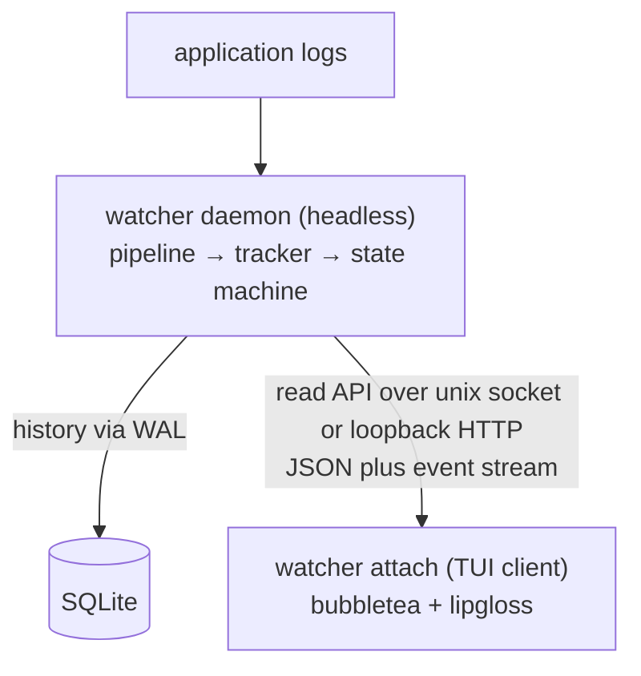

# 03 — Dashboard: Design

Requirements: [`requirements.md`](./requirements.md). Tasks:
[`tasks.md`](./tasks.md).

Dependencies: builds on `../01-core-engine/design.md` (pipeline, `Result`
type, config precedence), `../01b-runtime/design.md` (the `run` verb and
labeled sources), and `../02-production-shape/design.md` (incident state
machine, notification kinds). It consumes the tracker's outputs; it does not
change detection, fingerprinting, context curation, or the backend.

## 1. The central design decision: always headless

The daemon must never depend on a terminal. Reasons:

1. **Push, not pull.** A daemon that renders a TUI is a daemon someone has to
   be watching. The product's premise is that nobody is watching until
   something goes wrong.
2. **Containers have no TTY.** In the Compose deployment, the daemon runs as a
   service with no terminal; a UI built into the daemon would be dead code in
   production and would tempt split-brain state.

So the boundary is: **the daemon owns state and serves it; `attach` owns
rendering and owns nothing else.** `attach` is a separate process launched
explicitly by an operator, and it can be killed and restarted at will without
affecting detection.



Because the socket is a normal transport, this also makes the API usable by
other tooling later without designing a plugin surface now.

## 2. Transport and API surface

### 2.1 Transport

- Default: a Unix domain socket at `${XDG_RUNTIME_DIR}/watcher.sock`, falling
  back to `/var/run/watcher.sock`.
- The socket is created with `0600` permissions, owned by the daemon's user,
  so access control is filesystem-based and no auth token is needed.
- Loopback TCP (with a shared-secret header) is **not** implemented in this
  milestone; the Unix socket satisfies the requirement and keeps the auth surface
  at zero (OD-03-1). It can be added later without changing the wire shapes.
- The daemon fails clearly when the socket path is already held by a live
  process (DASH-5) rather than silently binding an alternative.

### 2.2 Routes (v1)

| Method | Path | Purpose |
|--------|------|---------|
| `GET` | `/api/v1/health` | Liveness, version, uptime, counters |
| `GET` | `/api/v1/incidents` | List rows: fingerprint, kind, source, severity, state, count, first_seen, last_seen, summary (truncated), explanation_pending |
| `GET` | `/api/v1/incidents/{id}` | Full detail: the list fields plus explanation fields, evidence array, and recent occurrence timestamps |
| `GET` | `/api/v1/events` | Server-Sent Events stream of mutations (created, counted, state-changed, explained) |

`{id}` is `source:fingerprint` — both halves are stable across restarts, which
is what lets the UI reselect the same incident after a reconnect or a daemon
restart, and what makes one row per distinct (source, crash) line up. The label
is part of the identity because the same crash text on two sources is two
incidents (01b §3.2), so the fingerprint alone cannot key a row; see the
deviation note in §8.

### 2.3 Live updates

Two mechanisms, deliberately redundant (DASH-19, DASH-21):

- **SSE** (`/api/v1/events`) is the primary channel: the daemon pushes a small
  event per mutation. SSE avoids a full WebSocket dependency, is trivially
  proxyable, and is a one-way stream, which matches the read-only UI.
- **Polling** is the fallback: if no SSE event arrives within a watchdog
  interval, the client re-fetches `/api/v1/incidents`. This guarantees the UI
  never silently freezes if the stream stalls behind a proxy.

Events carry the fingerprint and the changed field set, not the full row; the
client fetches detail lazily for the selected incident. This keeps the stream
small and means an unattended attach cannot balloon memory.

## 3. Persistence

### 3.1 Driver

A pure-Go SQLite driver (e.g. `modernc.org/sqlite`) is chosen over a cgo driver
to preserve the single-static-binary, no-cgo property from
`../01-core-engine/requirements.md` (CORE-NFR-5). Exact dependency is OD-03-2.

### 3.2 Schema

```sql
PRAGMA journal_mode = WAL;   -- concurrent readers alongside the writer

CREATE TABLE IF NOT EXISTS incidents (
  id           TEXT PRIMARY KEY,     -- fingerprint hash
  fingerprint  TEXT NOT NULL,
  kind         TEXT NOT NULL,
  source       TEXT NOT NULL,
  severity     TEXT,                 -- low|medium|high|critical, null until explained
  state        TEXT NOT NULL,        -- new|ongoing|resolved
  count        INTEGER NOT NULL DEFAULT 0,
  first_seen   TEXT NOT NULL,        -- RFC3339 UTC
  last_seen    TEXT NOT NULL,
  resolved_at  TEXT
);

CREATE TABLE IF NOT EXISTS explanations (
  id            INTEGER PRIMARY KEY AUTOINCREMENT,
  incident_id   TEXT NOT NULL REFERENCES incidents(id),
  created_at    TEXT NOT NULL,
  model         TEXT NOT NULL,
  summary       TEXT,
  likely_cause  TEXT,
  evidence_json TEXT,                -- JSON array, verbatim lines
  suggested_fix TEXT,
  confidence    REAL,
  severity      TEXT,
  pending       INTEGER NOT NULL DEFAULT 0,
  error         TEXT
);

CREATE TABLE IF NOT EXISTS occurrences (
  id          INTEGER PRIMARY KEY AUTOINCREMENT,
  incident_id TEXT NOT NULL REFERENCES incidents(id),
  seen_at     TEXT NOT NULL
);

CREATE INDEX IF NOT EXISTS idx_occ_incident_time
  ON occurrences (incident_id, seen_at DESC);
```

Notes:

- `explanations` is a history, not a single column, so a later re-explanation
  of the same fingerprint (after the explanation window elapses) is recorded
  rather than overwriting the earlier attempt.
- `occurrences` rows are what the detail pane's "recent activity" is built
  from; they are the retention chokepoint (DASH-25) — trimming old occurrence
  rows keeps the DB bounded while incidents and explanations stay small.
- Timestamps are stored as RFC3339 UTC text, matching the JSONL contract from
  milestone 01, so the same values round-trip without conversion surprises.

### 3.3 Write path and isolation

Database writes happen on a single dedicated goroutine consuming a channel, so:

- The detection pipeline never blocks on disk (DASH-NFR-2).
- The tracker's in-memory map remains the source of truth for the live state
  machine; the DB is a projection for history and the UI. This keeps milestone
  02's state machine semantics intact and makes persistence non-load-bearing: if
  the DB is unavailable, detection and notification still work (DASH-26).

WAL mode plus a read-only connection for the API handler gives concurrent
readers without blocking the writer (DASH-NFR-3).

### 3.4 Restart semantics

Two distinct things are persisted, and they matter differently:

- **History** (what happened) — always persisted; the UI shows prior incidents
  after a restart (DASH-23).
- **Notification state** (what we have already told someone) — the milestone-02
  design deliberately kept this process-local, with the rule that a restart
  never emits spurious `resolved` notifications (`../02-production-shape/design.md`
  §4.3).

This milestone does not change that rule: on startup the daemon rehydrates
history for display, but treats fingerprints as fresh for *notification*
purposes. Whether counts should instead resume cumulatively across a restart is
flagged as OD-03-3, because it changes user-visible notification text ("now at
N" where N resets versus accumulates).

## 4. TUI design (`watcher attach`)

### 4.1 Model

A single bubbletea model owning:

- `rows []IncidentRow` — sorted list state (DASH-17).
- `selected int` — cursor.
- `focus` — list or detail.
- `detail *IncidentDetail` — lazily fetched for the selected row.
- `conn` — connected / reconnecting / down (DASH-9).
- `events <-chan Event` — plumbing from the SSE/poll source into `Update`.

Data flow: an SSE (or poll) source goroutine emits `tea.Msg` values into the
program; the model updates state and re-renders. Rendering never performs I/O.
This is what keeps input latency independent of API/DB latency (DASH-NFR-1).

### 4.2 Layout

```
┌ Incidents ──────────────────────────────── 7 active · 2 resolved ─────────┐
│ ● HIGH   go-panic      web-1         ×12   2s ago   panic: send on closed… │
│ ● HIGH   python-tb     worker-2      ×3    1m ago   Traceback: KeyError…   │
│ ○ MED    generic-fatal api-1         ×1    9m ago   FATAL: connection re…  │
│ …                                                                          │
├ Detail ── a1b2c3d4e5f6a7b8 ── ongoing ─────────────────────────────────────┤
│ Summary      …                                                             │
│ Likely cause …                                                             │
│ Evidence     > panic: send on closed channel                               │
│              >   main.(*Hub).Broadcast(...)                                │
│ Suggested fix …                                                            │
│ Confidence   0.72   Severity HIGH   First 15:04:05Z   Last 15:06:11Z       │
├────────────────────────────────────────────────────────────────────────────┤
│ ↑/↓ select · tab panes · r refresh · ? help · q quit        ● connected     │
└────────────────────────────────────────────────────────────────────────────┘
```

- The list pane is allocated a configurable fraction of height (default ~45%),
  the detail pane the remainder; both are `lipgloss`-styled and clipped to
  their widths.
- Sort order (DASH-17): `resolved` last; within a state group, descending
  `last_seen`. Severity is shown per row but does *not* reorder the list, so
  rows do not jump around as severities arrive late — motion is the enemy of a
  list you are reading.
- Pending/unavailable explanations render as an explicit marker
  (`⏳ analysing` / `⚠ explanation unavailable`) rather than empty text
  (DASH-18).
- Resize handling recomputes layout from `WindowSizeMsg` every time (DASH-15);
  below a minimum (e.g. 60×16) the program renders a single centered message
  (DASH-16) instead of a broken two-pane layout.

### 4.3 Keys

| Key | Action |
|-----|--------|
| `↑` / `k`, `↓` / `j` | Move selection |
| `g` / `G` | Jump to first / last row |
| `tab` / `shift+tab` | Switch focus between list and detail |
| `pgup` / `pgdn` | Scroll the detail pane |
| `r` | Force refresh |
| `?` | Toggle help overlay |
| `q`, `ctrl+c` | Quit attach (does not affect the daemon) |

### 4.4 Degradation

`NO_COLOR` and `TERM=dumb` disable styling and switch the status glyphs to
ASCII (`*` / `o`) so the UI stays readable where color and box-drawing are
unavailable (DASH-NFR-4).

## 5. Reconnect and failure behavior

| Situation | Behavior |
|-----------|----------|
| No daemon at startup | Clear message + non-zero exit (DASH-8) |
| Socket disappears mid-session | Show "disconnected", retry with backoff, resume (DASH-9) |
| SSE stalls but socket alive | Watchdog triggers polling fallback (DASH-21) |
| Daemon restarted | Reconnect, re-fetch list, reselect the same fingerprint if it still exists |
| DB unavailable | Daemon runs without persistence; API serves in-memory state, UI shows a "history unavailable" banner (DASH-26) |
| API disabled by config | Daemon runs headless with no socket; `attach` reports "API disabled" (DASH-6) |

## 6. Configuration added in this milestone

| Setting | Flag | Env | Default |
|---------|------|-----|---------|
| API socket path | `--api-socket` | `WATCHER_API_SOCKET` | `${XDG_RUNTIME_DIR}/watcher.sock` |
| API enable/disable | `--api` | `WATCHER_API` | enabled |
| Database path | `--db` | `WATCHER_DB` | `./watcher.db` |
| Retention (age) | `--retention` | `WATCHER_RETENTION` | `720h` (30d) |
| Occurrences per incident kept | `--occurrence-cap` | `WATCHER_OCCURRENCE_CAP` | `100` |
| UI refresh bound | `--refresh-interval` | `WATCHER_REFRESH_INTERVAL` | `2s` |
| List pane height fraction | `--list-fraction` | `WATCHER_LIST_FRACTION` | `0.45` |

Retention and the occurrence cap each accept `0` to disable that bound. The SSE
watchdog is derived from the refresh interval (5×, floored at 1s) rather than
being a separate setting: it only decides when the fallback poll kicks in, and
the client's polling is free of charge when nothing is changing.

## 7. Testing strategy

- **Persistence** — round-trip tests: insert incidents/explanations/occurrences,
  reopen the DB, assert equality; migration test from an empty DB and from a
  newer schema; retention trimming test.
- **API** — `httptest` and a real Unix socket: health, list shape, detail shape,
  404 for an unknown id, multi-source ids with `/` and spaces round-tripping, and
  a stalled subscriber not blocking a publisher.
- **SSE** — assert an event is emitted per mutation and that a stalled reader
  does not block the daemon.
- **TUI model** — pure `Update`/`View` tests: drive `WindowSizeMsg` at many
  sizes (including below minimum) asserting no panic and the expected panes;
  drive key messages asserting selection and focus changes; assert sort order;
  a golden `View`.
- **Reconnect** — a fake event source that drops the connection and a quiet
  stream; assert the disconnected state appears, the watchdog polls, and
  reconnection restores updates.
- **Dogfood** — run the daemon against a fixture log and exercise the API over
  its socket (list, detail, 404, restart, DB-removed); `attach` is driven as far
  as the environment allows and its model is covered directly.

## 8. Decisions

These were open when the milestone was drafted. They are now resolved, and the
values below are what the implementation uses; the reasoning is recorded so a
later milestone can revisit a choice rather than rediscover it.

- **OD-03-1 — Unix socket only, or TCP as well.** *Resolved:* Unix-socket only.
  It satisfies DASH-2, and filesystem permissions (`0600`) give per-user access
  control with no token to manage or leak. Loopback TCP would add an auth
  surface and a second configuration shape for a case nothing has asked for yet;
  it stays available as a later addition that does not change the wire formats.
- **OD-03-2 — Pure-Go SQLite driver.** *Resolved:* `modernc.org/sqlite`. It is
  the de-facto pure-Go SQLite driver, works through `database/sql`, and is
  actively maintained, which preserves the single-binary, `CGO_ENABLED=0`
  property from `../01-core-engine/requirements.md` (CORE-NFR-5).
- **OD-03-3 — Counts/state across a restart.** *Resolved:* history is
  rehydrated for display, but notification state **and the live count cycle**
  restart fresh, consistent with `../02-production-shape/design.md` §4.3 and
  OD-02-5. A still-crashing fingerprint after a restart is announced as `new`
  with a count from one, and the resolve ticker — which only knows incidents the
  current process has seen — cannot produce a spurious `resolved`. Accumulating
  a lifetime count across a restart would make "now at N" misleading, so it is
  deliberately not done.
- **OD-03-4 — Default database path.** *Resolved:* `./watcher.db`, in the
  working directory. It matches the local, bare-metal reference shape the rest
  of the project uses; a deployment that wants a durable state directory (the
  container, or milestone 05's systemd unit) sets `--db`. Revisiting this for
  the install lifecycle is that milestone's call, not a silent change here.
- **OD-03-5 — Default retention.** *Resolved:* both bounds — 30 days of age and
  100 occurrence rows per incident, each disableable with `0`. Occurrences are
  the growth chokepoint (they accrue per crash while incidents and explanations
  stay small), so capping them bounds the database; the age cap additionally
  removes stale resolved incidents nobody will open again.
- **OD-03-6 — UI refresh bound and SSE watchdog.** *Resolved:* a 2s refresh
  interval, with the watchdog derived at 5× the interval (floored at 1s, so 10s
  by default). Two seconds is a bound far below human perception of "live" and
  costs nothing when nothing is changing, and there is no per-client cost at all
  when nobody is attached (DASH-3). The client resets the watchdog on every
  event, so polling happens only when the stream is genuinely quiet — which is
  exactly when there is nothing to miss.
- **OD-03-7 — Acknowledging/silencing from the TUI.** *Deferred:* out of scope
  here; the UI stays read-only (DASH-10). A later milestone wanting it would add
  write routes and would have to revisit this read-only contract.
- **OD-03-8 — Severity in list ordering.** *Resolved:* no. Ordering stays
  unresolved-first then by recency; severity is shown per row but does not
  reorder, so rows do not jump as severities arrive late.
- **OD-03-9 — Breakdown header.** *Resolved:* the minimal header from §4.2's
  layout, `N active · M resolved` (plus a "history unavailable" marker when the
  daemon is serving in-memory state). The at-a-glance question is how much is on
  fire, which the active/resolved split answers; a per-severity breakdown would
  add a line of chrome without changing what an operator does next.

One deviation from §2.2 worth recording: `{id}` is `source:fingerprint`, not the
fingerprint alone. The route table was written against milestone 01, where an
incident was keyed by fingerprint; milestone 01b made the identity
`(label, fingerprint)` because the same crash text on two sources is two
incidents. Keying rows by the fingerprint alone would collapse those into one,
so the id carries both halves — still stable across restarts, which is the
property §2.2 actually needed.
