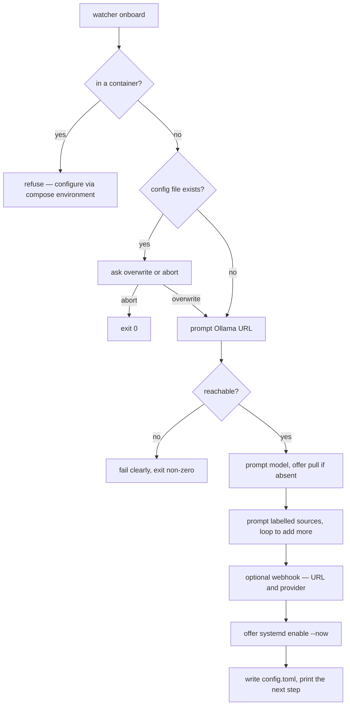

# 05 — Install Lifecycle: Design

Requirements: [`requirements.md`](./requirements.md). Tasks:
[`tasks.md`](./tasks.md).

Dependencies: builds on `../01b-runtime/design.md` — the `run` verb and verb
grammar, the labeled multi-source engine, and the webhook sink — and on
`../01-core-engine/design.md` for the configuration model it extends. It
depends on nothing later than itself. It is the *local device* counterpart of
milestone 02's container packaging.

## 1. Goals and constraints

The target lifecycle is: **install → optionally onboard → runs in the
background.** Three constraints shape it.

- **The binary does not manage itself.** No double-fork, no PID file. It runs
  in the foreground and the platform supervises it. This is the same decision
  00–02 already assume; this milestone just ships the supervisor artifact.
- **Configuration must be persistable.** Onboarding is worthless without
  somewhere to write, so this milestone adds the config-file rung that 01b
  deliberately left out. It is additive: no existing flag or env var changes
  meaning.
- **Onboarding is local-only.** A container has no terminal and its
  configuration is the Compose `environment:` block. Onboarding must refuse to
  run there rather than inventing a second way to configure the container.

## 2. Installer

### 2.1 What it does

1. Detect OS and architecture.
2. Download the matching release artifact for the requested version.
3. **Verify the published checksum**; abort on mismatch.
4. Install the binary: `/usr/local/bin` (system) or `~/.local/bin` (per-user),
   and ensure it is on `PATH`.
5. Optionally print or install the systemd unit.
6. Offer an uninstall path.

This is the manual "clone → compile → copy somewhere" loop made repeatable,
plus the two things the manual loop lacks: **integrity verification** and a
**service unit**. A package manager (Homebrew, apt, scoop) performs the same
steps with upgrade tracking; distributing that way is a stretch goal
(INST-PKG-7), not a requirement here.

### 2.2 Failure discipline

Every step is fail-fast: a download error, a bad checksum, or a permission
problem aborts non-zero and leaves no partial install (INST-PKG-6). A per-user
install never needs root (INST-PKG-7).

## 3. Config file and precedence

### 3.1 Location and shape

Default path `$XDG_CONFIG_HOME/watcher/config.toml`, falling back to
`~/.config/watcher/config.toml`; overridable by `--config` /
`WATCHER_CONFIG` (INST-CFG-5). TOML is chosen for a plain, inspectable,
comment-friendly file that needs no schema tooling.

```toml
# ~/.config/watcher/config.toml
ollama_url = "http://localhost:11434"
model = "qwen2.5-coder:0.5b"

[[sources]]
label = "backend"
path = "/var/log/backend/app.log"

[[sources]]
label = "worker"
path = "/var/log/worker/app.log"

[webhook]
url = "https://discord.com/api/webhooks/…"
provider = "discord"
```

The full key set mirrors the flag/env tables in `01-core-engine/design.md` §12
and `01b-runtime/design.md` §7; `sources` is an array of tables because a
source is a pair, not a scalar. (The exact key spelling is OD-05-6.)

### 3.2 Precedence

```
flag  >  environment  >  config file  >  default
```

This extends 01's two-rung model with one rung and changes nothing about the
existing two: an operator who never creates a config file sees identical
behaviour (INST-CFG-2). The file is read at startup and validated with the same
validation as flags and env, so a bad value in the file fails the same way
(INST-CFG-4).

### 3.3 Why a file at all

Without it, "onboarding" would have to either modify the environment (which a
program cannot do for its parent) or hand the operator a string of flags to
copy — neither of which survives a reboot. The file is what makes the configured
state *durable*, which is what makes step 3 of the lifecycle ("keeps running in
the background") meaningful.

## 4. Onboarding

### 4.1 Flow



Steps in order, per INST-ONB-3..10:

1. **Existing config** — ask to overwrite or abort; never silently replace.
2. **Ollama URL** — prompt (default `http://localhost:11434`), then **verify
   connectivity before continuing**. This is the second invariant below.
3. **Model** — pre-filled with the recommended default; accept with enter or
   name another; offer to pull if absent.
4. **Sources** — prompt for file paths, looped, each labelled. There is no
   "watch everything" option.
5. **Webhook** — optional; URL and provider (Slack/Discord/generic); skippable.
6. **Service** — offer to install and enable the systemd unit, so onboarding can
   take someone straight to "running in the background".
7. **Write and report** — write `config.toml`, then print the next step
   depending on whether the unit was enabled.

### 4.2 The two invariants

Stated here so they are properties of the design, not incidental behaviour:

1. **Onboarding never infers what to watch** (INST-ONB-11). Every source is a
   path the operator typed, with a label the operator chose — the same rule
   01b enforces at runtime (its rejected content-inference approach, §10).
2. **Onboarding never writes a config it has not validated against a live
   Ollama** (INST-ONB-12). A config that only fails later, at `watcher run`, is
   worse than no config: it hides the failure from the one moment the operator
   is present to fix it.

### 4.3 Container refusal

`watcher onboard` detects a container (e.g. `/.dockerenv`, or the cgroup) and
refuses with a message pointing at the Compose `environment:` block
(INST-ONB-2). There is exactly one way to configure the container, and it is not
this.

### 4.4 Non-interactive future

The prompts are designed so that each can later be answered by a flag
(`--file`, `--model`, `--yes`), letting provisioning tools drive onboarding.
That is recorded as a future extension (INST-ONB-14), not built now — but the
prompt order above is the contract a flag-driven mode would satisfy.

## 5. Supervisor model

The binary and the supervisor have separate jobs, and the split is the reason
no daemonization code exists:

| Responsibility | Owner |
|---|---|
| Run the pipeline in the foreground; handle `SIGTERM`; shut down cleanly | `watcher run` |
| Start at boot; restart on crash; stop on shutdown | systemd |
| Capture and rotate logs | journald |

The unit stays minimal:

```ini
[Unit]
Description=Watcher
After=network-online.target

[Service]
ExecStart=/usr/local/bin/watcher run
Restart=always
RestartSec=2
Type=simple

[Install]
WantedBy=multi-user.target
```

`systemctl enable --now watcher` is the whole "run in the background" step
(INST-SVC-2), and it is optional — a foreground `watcher run` works too. macOS's
launchd equivalent is deliberately deferred (INST-SVC-4, OD-05-4).

## 6. Relationship to the container shape

This milestone creates the symmetry 01b set up:

| | Container (02) | Device (05) |
|---|---|---|
| Config source | Compose `environment:` | `config.toml` (+ env, flags) |
| First-run step | none — the compose file *is* the config | `watcher onboard` (optional) |
| Supervisor | Docker (`restart: unless-stopped`) | systemd (`Restart=always`) |
| Entry point | `watcher run` | `watcher run` |
| Backgrounding | the container runs detached | `systemctl enable --now` |

Both shapes run the same binary, the same pipeline, and the same verb. They
differ only in *where configuration comes from* and *who supervises* — which is
exactly the separation 01b's design argued for. Onboarding is the local
equivalent of the Compose `environment:` block, and neither replaces the other.

## 7. Failure modes

| Failure | Behaviour |
|---|---|
| Checksum mismatch during install | Abort non-zero; nothing installed |
| Config file absent | Run with defaults; no error |
| Config file malformed / invalid value | Fail with the file and problem named |
| Ollama unreachable during onboarding | Fail clearly at that step; write nothing |
| `onboard` run inside a container | Refuse, point at the Compose environment |
| systemd not present (e.g. macOS) | Onboarding skips the service step; prints the manual next step |
| Uninstall | Remove binary + unit; remove config only on confirmation |

## 8. Testing strategy

- **Installer** — a script test harness against a fake release server: OS/arch
  selection, checksum pass/fail, per-user vs system paths, uninstall, and
  fail-fast on each error.
- **Config file** — table tests across `flag > env > file > default` for
  representative settings; malformed file; invalid value; absent file;
  path override.
- **Onboarding** — drive it with a scripted input reader and an `httptest`
  Ollama: asserts prompt order, the connectivity check (fails on an unreachable
  URL and writes nothing), the existing-file overwrite prompt, the
  container-refusal path, and the exact TOML written.
- **Unit file** — a golden check that the shipped unit is what the docs say.
- **End to end** — install into a temp prefix, onboard against a fake Ollama,
  then `watcher run` reads the config and starts, and reports an incident from a
  fixture log.

## 9. Open decisions

- **OD-05-1** — Default install directory and whether the installer prefers
  per-user (no root) or system-wide.
- **OD-05-2** — Whether uninstall removes the config file by default or only on
  an explicit flag.
- **OD-05-3** — Release artifact naming/versioning and where checksums are
  published (GitHub Releases, a `checksums.txt`, etc.).
- **OD-05-4** — launchd/macOS support: whether, and in which milestone.
- **OD-05-5** — Where a webhook secret lives: inside `config.toml` (mode `0600`)
  or a separate secret file referenced by path.
- **OD-05-6** — The exact config-file key schema (mirror env var names vs nested
  sections such as `[webhook]`).
- **OD-05-7** — Whether `watcher run`'s first-run hint (INST-ONB-13) should also
  offer to launch onboarding directly, or only name it.
